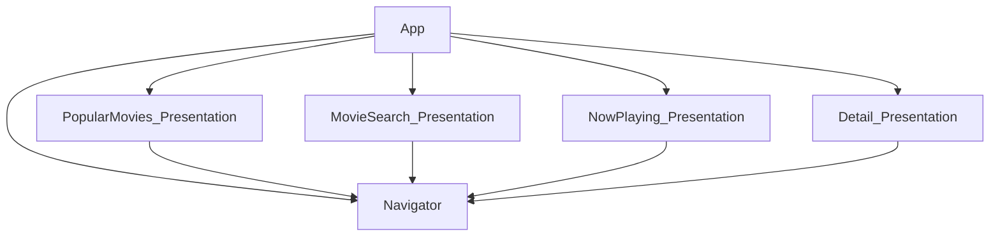
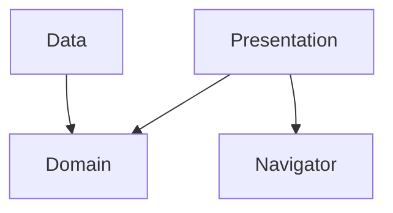

# Clean Architecture Compose Playground

## 목차

- [Architecture](#architecture)
- [Libraries](#libraries)

## Architecture

### MutliModule

## Feature Module

## Libraries

- [Jetpack](https://developer.android.com/jetpack)
  - [Viewmodel](https://developer.android.com/topic/libraries/architecture/viewmodel)
  - [LiveData](https://developer.android.com/topic/libraries/architecture/livedata)
  - [Compose](https://developer.android.com/jetpack/compose)
        [MotionLayout](https://developer.android.com/develop/ui/views/animations/motionlayout)
- [Retrofit](https://square.github.io/retrofit/)
- [okhttp-logging-interceptor](https://github.com/square/okhttp/blob/master/okhttp-logging-interceptor/README.md)
- [kotlinx.coroutines](https://github.com/Kotlin/kotlinx.coroutines)
- [Coil](https://coil-kt.github.io/coil/)
- [Hilt](https://developer.android.com/training/dependency-injection/hilt-android)